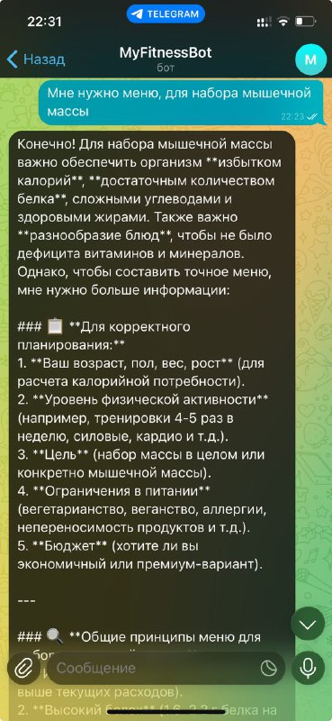

# 03-aidd — Telegram LLM assistant (MyFitnessBot)

Проект 03-aidd — минимальный Telegram-ассистент, использующий LLM для ответов о фитнесе и питании. Бот отвечает на команды и текстовые сообщения, хранит историю диалога и формирует ответы от внешней модели через OpenRouter.

- **Роль ИИ-ассистента**: персональный тренер по фитнесу и питанию.
  - Обоснование: роль согласована с системным промптом и целевой аудиторией — пользователи ожидают краткие, практичные рекомендации по диете и упражнениям.

- **Реализованные возможности:**
  - [x] Запуск бота (polling)
  - [x] Обработчик `/start` — приветствие и очистка истории
  - [x] Обработчик текстовых сообщений, отправка запроса к LLM
  - [x] Хранение per-user истории с лимитом (`MAX_HISTORY_MESSAGES`)
  - [x] Сохранение ID отправленных ботом сообщений и их удаление при `/start`
  - [x] Интеграция с OpenRouter через `openai.AsyncOpenAI`
  - [x] `Makefile` для быстрой настройки виртуального окружения и запуска (локально)
  - [x] `.env.example` с перечнем необходимых переменных окружения (добавлен вручную)
  - [x] Папка `screenshots/` (с `.gitkeep`) для хранения скриншотов

- **Технологический стек**:
  - Python 3.11+
  - aiogram (Telegram bot framework)
  - openai (AsyncOpenAI client) через OpenRouter
  - python-dotenv
  - Makefile для локальных команд

- **Инструменты AI-driven разработки:**
  - **AI-coding IDE**: Cursor
  - **LLM-модели, используемые для генерации кода и документации**: OpenRouter model `minimax/minimax-m2:free` (через `AsyncOpenAI`).
  - Вспомогательно использовались подсказки и итерационные правки ассистента для создания и правки файлов.

- **Скриншот работы:**
  - Скриншоты диалогов и ответов бота сохранены в `screenshots/`:
    - `screenshots/scr3_0.jpg`
    - `screenshots/scr3_1.png`
    - `screenshots/scr3_2.png`
    - `screenshots/scr3_3.png`
  - Превью изображений:

- **Процесс разработки**:
  - Разработка шла итерациями, следуя `docs/tasklist.md`.
  - В целом процесс протекал относительно легко, потребовалось доработать конфигурацию зависимостей и управлять ключами доступа к OpenRouter.

- **Что узнал нового в процессе AI-driven разработки:**
  - Нужно чётко формулировать задачи для ассистента.
  - Не бояться поправлять или уточнять ответы ассистента.
  - Иногда нужно перепроверять генерируемый код и конфигурации (особенно зависимости и env-переменные).

---

Файл подготовлен автоматически ассистентом в среде Cursor по запросу разработчика.

