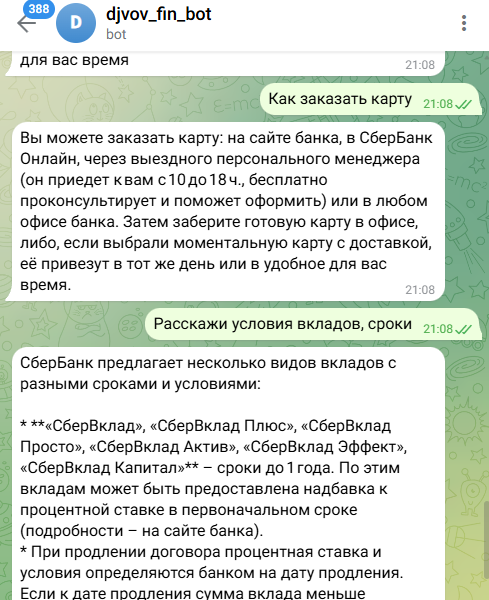
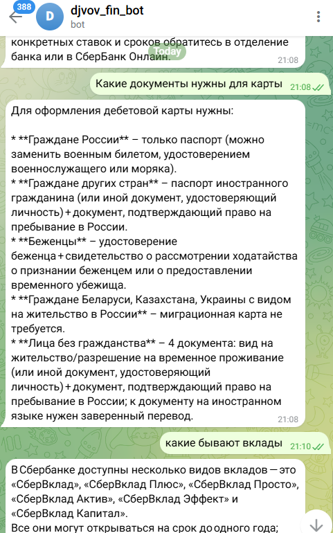
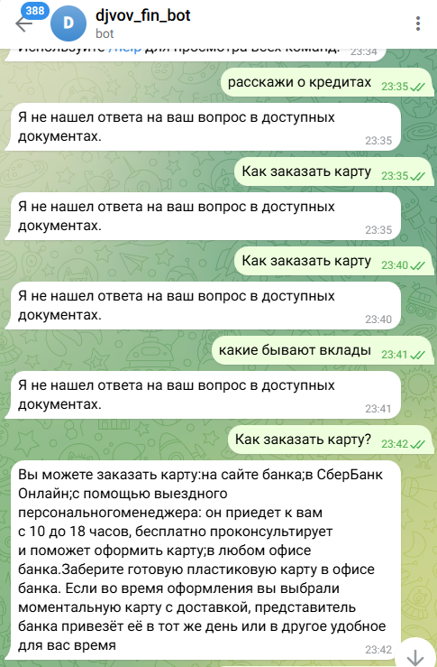

# Отчёт о выполнении задания

- **Название проекта**: telegram-llm-bot
- **Краткое описание**: Простой Telegram-бот с интеграцией LLM для обработки банковских/финансовых документов, локальной индексацией и поиском по JSON-датасету.
- **Вариант задания**: базовый

- **Реализованные возможности**

- [x] загрузка JSON-данных
- [x] локальный embedding с Ollama

- **Технологический стек**

- Python 3.11
- LangChain (core, community, text-splitters)
- Ollama (локальные embedding/LLM)
- OpenAI (опционально для сравнения)
- aiogram (Telegram bot)
- pypdf, jq, python-dotenv

- **Используемые модели**

- gpt-oss-120b
- qwen3-reranker-8b
- multilingual-e5-large-instruct

---

ВАЖНО — Эксперименты с индексацией

- Описание экспериментов с разными размерами чанков:

  - при увеличении размеров чанка и оверлапа ответы стали чуть более детальными, но менее релевантными
  - при использовании сепараторов с учетом структуры документа ответы стали более структурированными

- Наблюдения и выводы:

  - для банковских документов лучше чанки и оверлап поменьше, но с сепараторами по структуре

---

ВАЖНО — Работа с JSON датасетом

- Как реализовали загрузку JSON: с помощью `json.load`
- Скриншоты работы с вопросами про карты:
  - 
  - 

---

ВАЖНО — Сравнение моделей эмбеддингов

- Тестировали модели эмбеддингов: `qwen3-reranker-8b`, `multilingual-e5-large-instruct`

- Таблица сравнения качества ответов:

|Модель|Ответы на точные вопросы|Ответы на не точные вопросы|
|---|---:|---:|
|qwen3-reranker-8b|+|-|
|multilingual-e5-large-instruct|+|+|

- Выводы: модель эмбеддингов для русского языка лучше — `multilingual-e5-large-instruct`

---

Скриншоты

- 
- 
- 

