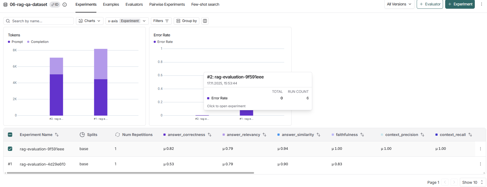
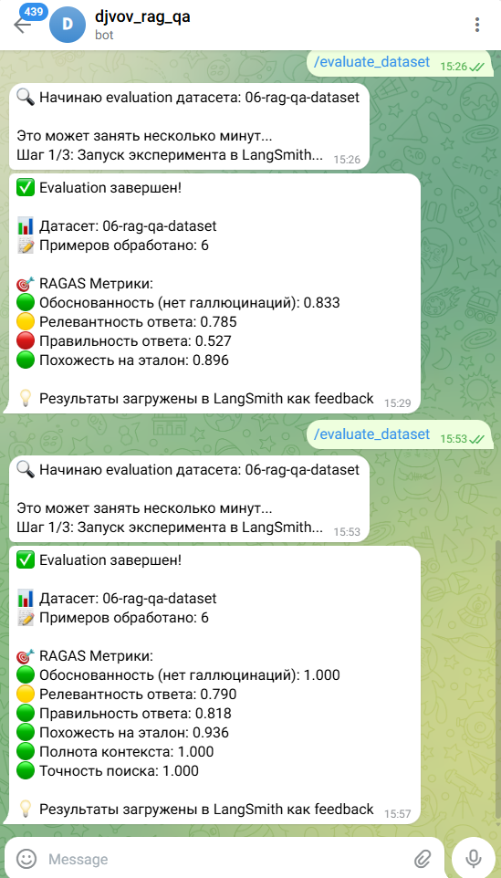

# Отчёт о выполнении задания — 06-monitoring-qa

Проект: `06-monitoring-qa`  
Краткое описание: Репозиторий реализует RAG-ассистента и инструменты для синтеза датасетов и оценки качества RAG-системы (сбор чанков из документов, генерация Q&A пар через LLM, сохранение датасета и загрузка в LangSmith; метрики RAGAS для оценки).

Вариант задания: базовый

Используемые модели и провайдеры:
- Модель: `fireworks/gpt-oss-120b`
- Провайдер: `fireworks`

Создание и загрузка датасета
- Как создавали датасет: автоматический синтез Q&A пар с помощью скрипта `src/dataset_synthesizer.py` — сбор чанков из PDF/JSON, генерация вопросов и эталонных ответов через LLM (используется `ChatOpenAI` в коде), затем сохранение в `datasets/06-rag-qa-dataset.json`.
- Команда для создания локально: `uv run python src/dataset_synthesizer.py --create` (или `make dataset`).
- Размер датасета: 6
- Скриншот страницы датасета в LangSmith:
  - Ссылка: [screenshots/ls.png](screenshots/ls.png)  
  - Вставка изображения (локальная): 

Примеры Q&A пар (взято из `datasets/06-rag-qa-dataset.json`):

Пример 1
```
question: "Какие основные разделы включены в Общие условия предоставления, обслуживания и погашения потребительского кредита?"
ground_truth: "В Общих условиях указаны четыре раздела: 1) Основные положения (Кредит, Договор, Стороны, Обеспечение), 2) Порядок заключения Договора и предоставления Кредита, 3) Порядок заключения Договора, 4) Акцепт Индивидуальных условий кредитования (ИУ) Кредитором."
```

Пример 2
```
question: "Как распределяются средства, поступившие на счет Кредитора, если просроченная задолженность отсутствует?"
ground_truth: "Если просроченной задолженности нет, поступившие на счет Кредитора средства направляются на погашение срочной задолженности по кредиту и уплату срочных процентов за пользование кредитом."
```

Оценка качества через RAGAS
- Используемые метрики:
  - Faithfulness
  - AnswerRelevancy
  - AnswerCorrectness
  - AnswerSimilarity
  - ContextRecall
  - ContextPrecision

Выводы
- Главные инсайты о качестве RAG системы:
  - Система показывает лучшие результаты при корректном системном промпте, умеренной температуре генерации и хорошем размере чанков (слишком большие или слишком мелкие чанки ухудшают релевантность/точность).
  - Качество синтезированных эталонных ответов напрямую зависит от выбранной модели и её доступности у провайдера; недоступность модели приводит к ошибкам при создании датасета (например, ошибка "Model not found" при неверном имени модели).

Все скриншоты из папки `screenshots/`:

- [screenshots/ls.png](screenshots/ls.png)  
  

- [screenshots/bot.png](screenshots/bot.png)  
  

