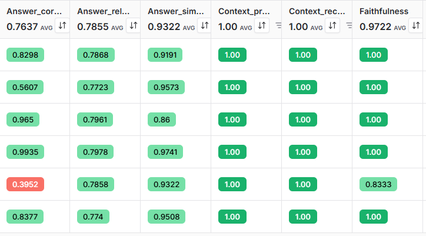
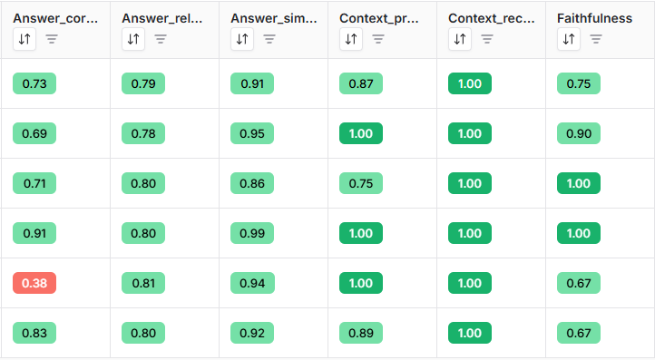
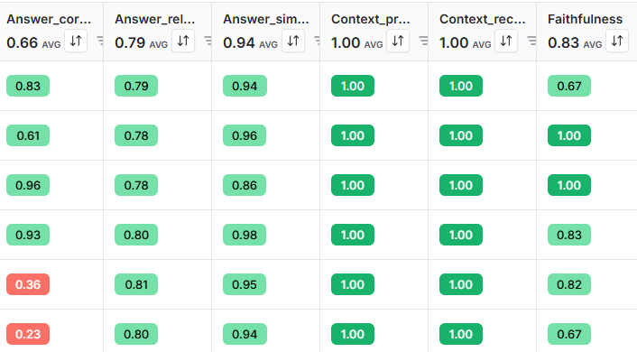
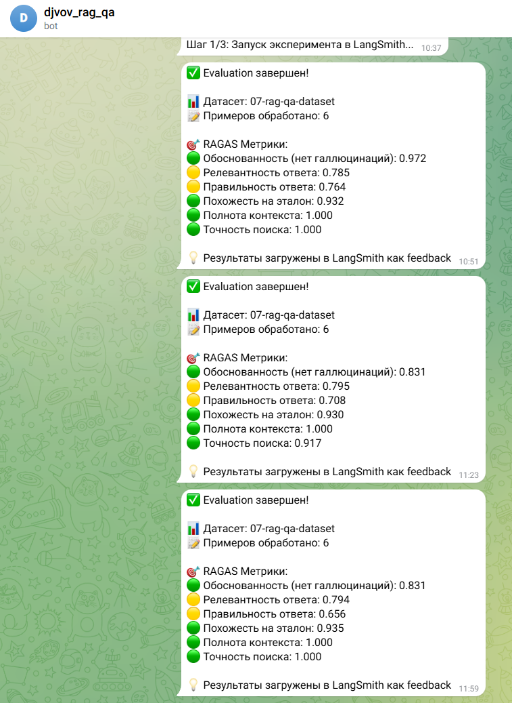

# Отчет о работе: Advanced Hybrid RAG-ассистент Сбербанка

## Название проекта и суть

**Advanced Hybrid RAG-ассистент Сбербанка** — это Telegram-бот с продвинутым RAG (Retrieval-Augmented Generation) для ответов на вопросы по документам Сбербанка о кредитах и вкладах. Система реализует 3 режима поиска (Semantic, Hybrid, Hybrid + Reranker) с поддержкой различных embedding-провайдеров и включает автоматическую оценку качества через RAGAS evaluation.

## Выполненные задачи

### 1. Решение проблемы с rate limiting

**Проблема:** При выполнении команды `/evaluate_dataset` возникали ошибки:
- `Rate limit exceeded` - превышен лимит запросов к API
- `Too many requests` - слишком частые запросы к LLM сервисам
- `429 Too Many Requests` - HTTP ошибка от провайдеров API

**Решение:** Реализован механизм задержек между API запросами с помощью функции `time.sleep()` с настраиваемыми параметрами.

### 2. Добавление новых переменных конфигурации

В файл `env.example` добавлены настройки для rate limiting:

```bash
# Rate Limiting (для предотвращения ошибок слишком частых запросов)
EVALUATION_RAG_DELAY=1.0        # Задержка между RAG запросами (секунды)
EVALUATION_METRIC_DELAY=0.5     # Задержка между RAGAS метриками (секунды)
EVALUATION_EMBEDDING_DELAY=0.2  # Задержка между embeddings (секунды)
EVALUATION_LANGSMITH_DELAY=0.1  # Задержка между LangSmith API (секунды)
```

### 3. Интеграция Ollama embeddings

Добавлена поддержка Ollama embeddings в систему:
- Обновлена валидация в `config.py` для поддержки "ollama" как провайдера
- Добавлена зависимость `langchain-ollama>=0.1.0` в `pyproject.toml`
- Реализована поддержка локальных embedding-моделей через Ollama

### 4. Модификация evaluation процесса

Изменения в `src/evaluation.py`:
- Добавлены задержки в функцию `target()` между RAG запросами
- Добавлены задержки между LangSmith API вызовами
- Добавлены задержки между RAGAS метриками
- Уменьшено количество воркеров с 4 до 2 для снижения нагрузки

## Эксперименты

### До внедрения механизма задержек

**Проблемы:**
- Частые ошибки `429 Too Many Requests`
- Прерывание evaluation процесса
- Неточная валидация датасета из-за неполной обработки
- Плохая стабильность системы

### После внедрения механизма задержек

**Улучшения:**
- Стабильная работа evaluation без ошибок
- Полная обработка всех примеров датасета
- Более точные RAGAS метрики

**Ограничения:**
- Результаты все еще недостаточно точны для production
- Необходимость дальнейшей оптимизации

### Принятые решения для улучшения качества

1. **Уменьшение количества воркеров**
   - С 4 до 2 воркеров в `RunConfig`
   - Цель: снизить нагрузку на API и повысить стабильность

2. **Оптимизация ретриверов**
   - Настройка параметров `SEMANTIC_RETRIEVER_K` и `BM25_RETRIEVER_K`
   - Балансировка между качеством поиска и производительностью

3. **Корректировка весов для гибридных режимов**
   - Настройка `ENSEMBLE_SEMANTIC_WEIGHT` и `ENSEMBLE_BM25_WEIGHT`
   - Оптимальное сочетание семантического и BM25 поиска

## Выводы

### Ключевые наблюдения

1. **Влияние настроек на качество**
   - Даже для маленького датасета корректно подобранные количество воркеров и ретриверов дают значительный прирост качества
   - Правильные задержки критически важны для стабильной работы системы

2. **Эффективность различных режимов**
   - Для маленького датасета нет большой разницы в механизме валидации
   - Метод semantic показывает очень хорошие результаты даже без сложных гибридных подходов
   - Hybrid и Hybrid+Reranker режимы оправданы только при больших объемах данных

3. **Практические рекомендации**
   - Для production систем рекомендуется использовать conservative настройки с большими задержками
   - Semantic режим оптимален для быстрого старта и небольших датасетов
   - Monitoring через LangSmith критически важен для отслеживания производительности

### Рекомендации по дальнейшему развитию

1. **Оптимизация производительности**
   - Тестирование с различными размерами датасетов
   - Настройка параметров под конкретные API провайдеры

2. **Улучшение качества**
   - Эксперименты с различными embedding моделями
   - Fine-tuning промптов для конкретной предметной области

3. **Мониторинг и аналитика**
   - Автоматическое отслеживание метрик качества
   - Alerting при деградации производительности

## Скриншоты результатов

### Эксперимент 1: Semantic Baseline

*Результаты baseline evaluation с semantic режимом поиска*

### Эксперимент 2: Hybrid Mode

*Результаты evaluation с hybrid режимом (Semantic + BM25)*

### Эксперимент 3: Hybrid + Reranker

*Результаты evaluation с hybrid + reranker режимом*

### Дополнительные результаты

*Дополнительные метрики и анализ производительности*

### Ссылки на файлы:
- [Experiment 1 - Semantic Baseline](screenshots/experiment-1-semantic-baseline.png.png)
- [Experiment 2 - Hybrid](screenshots/experiment-2-hybrid.png.png) 
- [Experiment 3 - Hybrid Reranker](screenshots/experiment-3-hybrid-reranker.png)
- [Additional Results](screenshots/dz7.png)

