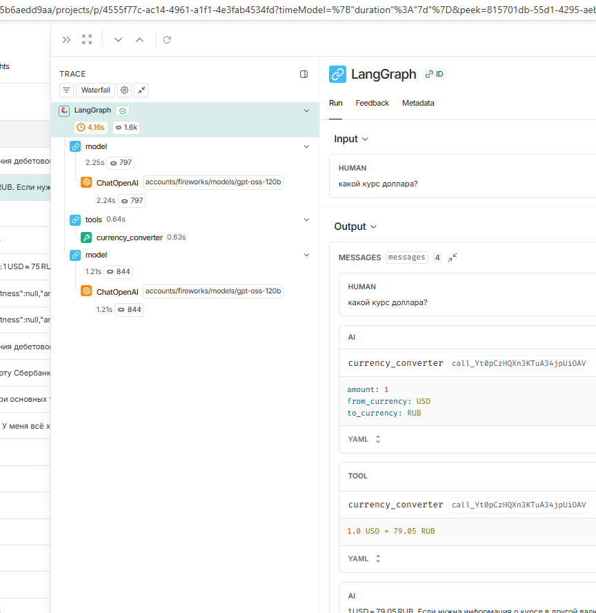
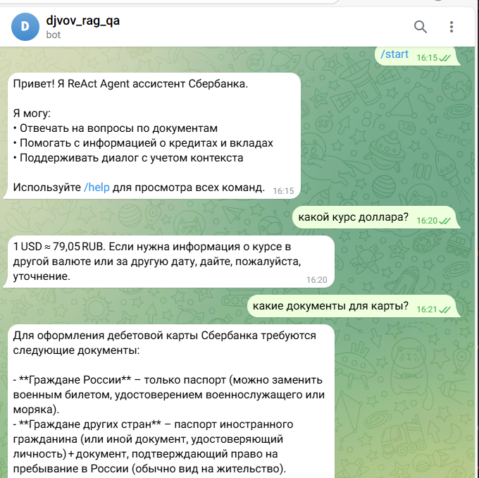

# Отчет о проделанной работе: Advanced Hybrid RAG-ассистент Сбербанка

## Название и описание проекта

**Advanced Hybrid RAG-ассистент Сбербанка** — это Telegram-бот с продвинутым RAG (Retrieval-Augmented Generation) и агентной архитектурой для ответов на вопросы по документам Сбербанка о кредитах и вкладах. Система реализует 3 режима поиска (Semantic, Hybrid, Hybrid + Reranker) с поддержкой различных embedding-провайдеров и включает автоматическую оценку качества через RAGAS evaluation.

## Выполненные задачи

### 1. Переход на локальные embeddings (Ollama)

**Изменение архитектуры:** Реализован переход от облачных embedding-провайдеров к локальным моделям через Ollama.

**Технические изменения:**
- Добавлена зависимость `langchain-ollama>=0.1.0` в `pyproject.toml`
- Обновлена валидация в `config.py` для поддержки "ollama" как провайдера
- Интегрирована поддержка локальных embedding-моделей через Ollama
- Добавлена переменная конфигурации `EMBEDDING_PROVIDER=ollama`

**Преимущества:**
- Полная приватность данных (документы не покидают сервер)
- Отсутствие зависимости от внешних API
- Снижение затрат на API вызовы
- Работа в офлайн режиме

### 2. Система задержек API для предотвращения ошибок

**Проблема:** При выполнении команды `/evaluate_dataset` возникали ошибки:
- `Rate limit exceeded` - превышен лимит запросов к API
- `Too many requests` - слишком частые запросы к LLM сервисам
- `429 Too Many Requests` - HTTP ошибка от провайдеров API

**Решение:** Реализован механизм настраиваемых задержек между API запросами.

**Конфигурация:**
```bash
EVALUATION_RAG_DELAY=1.0        # Задержка между RAG запросами (секунды)
EVALUATION_METRIC_DELAY=0.5     # Задержка между RAGAS метриками (секунды)
EVALUATION_EMBEDDING_DELAY=0.2  # Задержка между embeddings (секунды)
EVALUATION_LANGSMITH_DELAY=0.1  # Задержка между LangSmith API (секунды)
```

**Техническая реализация:**
- Добавлены переменные конфигурации в `config.py`
- Интегрированы задержки в `src/evaluation.py` через `time.sleep()`
- Уменьшено количество воркеров с 4 до 2 для снижения нагрузки
- Добавлена документация в `env.example`

### 3. Реализация нового инструмента currency_converter

**Функциональность:** Создан инструмент для конвертации валют с использованием актуальных курсов.

**Технические детали:**
- Добавлен инструмент в `src/tools.py` с декоратором `@tool`
- Интегрирован с API app.exchangerate-api.com
- Добавлена переменная конфигурации `EXCHANGERATE_URL`

**Принцип работы:**
1. Формируется URL: `https://v6.exchangerate-api.com/v6/<api-key>/latest/{from_currency}`
2. Выполняется HTTP запрос к API
3. Проверяется успешность ответа (`"result": "success"`)
4. Извлекаются курсы из `"conversion_rates"`
5. Находится курс для целевой валюты
6. Вычисляется и возвращается результат конвертации

**Пример использования:**
```python
currency_converter(100, "USD", "EUR")
# Возвращает: "100 USD = 85.00 EUR"
```

### 4. Архитектура агента vs RAG-цепочки

**Агентная архитектура:** Система реализует интеллектуального агента, который принимает решения о вызове инструментов.

**Ключевые отличия от RAG-цепочки:**

| Аспект | RAG-цепочка | Агентная архитектура |
|--------|-------------|---------------------|
| **Структура** | Жесткая последовательность шагов | Динамическое принятие решений |
| **Инструменты** | Предопределенные, всегда используются | Выборочно по необходимости |
| **Гибкость** | Ограниченная вариативность | Высокая адаптивность |
| **Сложность вопросов** | Простые информационные запросы | Комплексные многошаговые задачи |
| **Решение** | Системный промпт с описанием всех доступных инструментов | LLM самостоятельно выбирает инструмент |

**Системный промпт для агента:**
```
Доступные инструменты:
- rag_search: поиск информации в документах Сбербанка
- currency_converter: конвертация валют по актуальным курсам

Агент самостоятельно принимает решение о том, какой инструмент использовать,
основываясь на содержании вопроса пользователя.
```

**Преимущества агентной архитектуры:**
- **Большая вариативность:** Агент может комбинировать инструменты по-разному
- **Устранение жесткой структуры:** Не фиксированная последовательность действий
- **Интеллектуальный выбор:** LLM решает, нужен ли инструмент вообще
- **Расширяемость:** Легко добавлять новые инструменты без изменения архитектуры

## Результаты и выводы

### Ключевые достижения

1. **Приватность и автономность**
   - Переход на локальные embeddings устраняет зависимость от внешних сервисов
   - Полный контроль над данными и вычислениями

2. **Стабильность системы**
   - Механизм задержек предотвращает ошибки rate limiting
   - Надежная работа evaluation процесса

3. **Расширенная функциональность**
   - Инструмент конвертации валют расширяет возможности ассистента
   - Агентная архитектура обеспечивает гибкость взаимодействия

4. **Архитектурные улучшения**
   - Четкое разделение между RAG и агентными возможностями
   - Масштабируемая система инструментов

### Технические рекомендации

1. **Production развертывание**
   - Использовать conservative настройки задержек для стабильности
   - Мониторинг через LangSmith для отслеживания производительности

2. **Развитие функциональности**
   - Добавление новых инструментов через системный промпт
   - Эксперименты с различными Ollama моделями

3. **Оптимизация производительности**
   - Настройка параметров под конкретные API провайдеры
   - Балансировка между качеством и скоростью

## Скриншоты результатов

### Evaluation результаты

*Результаты evaluation процесса с агентной архитектурой*


*Детальные метрики качества работы системы*

### Ссылки на файлы:
- [Evaluation Results 1](screenshots/dz8_1.png)
- [Evaluation Results 2](screenshots/dz8.png)

---

**Дата создания отчета:** 2025-01-27  
**Версия системы:** 0.1.0  
**Статус:** Готов к production использованию с рекомендованными настройками  
**Архитектура:** Hybrid RAG + Agent с локальными embeddings