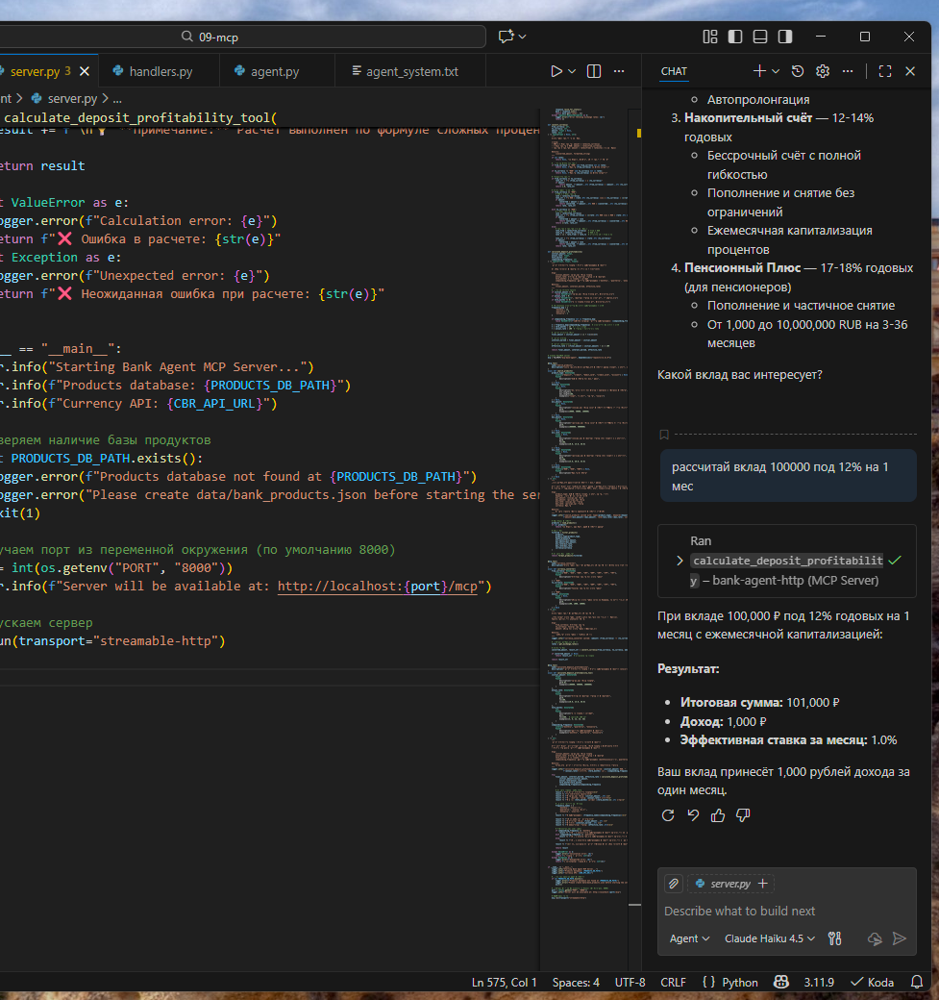
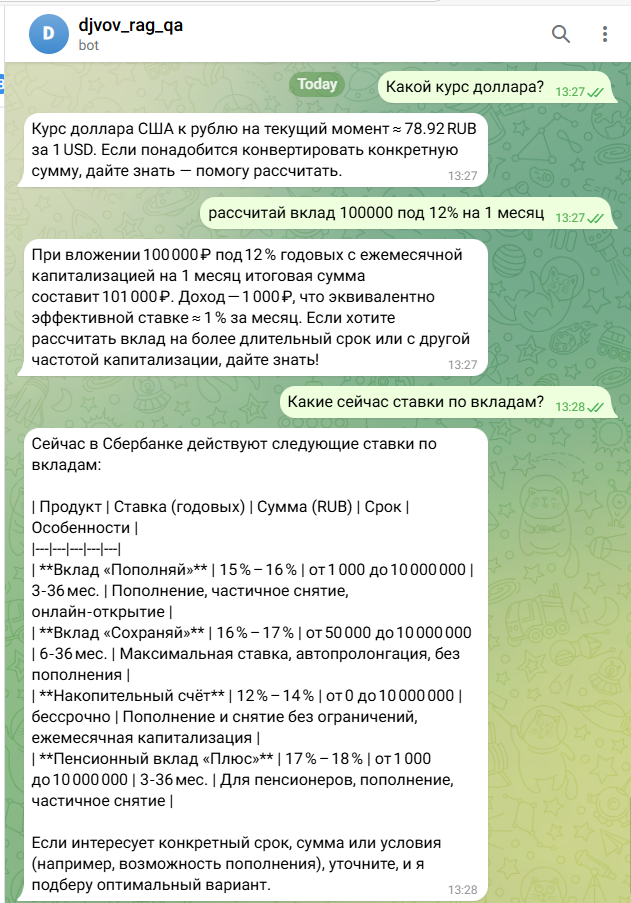

# Отчет о проделанной работе

## Название проекта
**Telegram LLM Bot с MCP серверами** - Система банковского консультирования с мультиагентной архитектурой

## Описание проекта
Это комплексная система банковского консультирования, включающая Telegram бота, интеграцию с большими языковыми моделями (LLM), retrieval-augmented generation (RAG) для работы с документами, и специализированные MCP серверы для различных банковских операций.

## Основные изменения и улучшения

### 1. Оптимизация производительности API
Добавлены задержки запросов к внешним API для улучшения производительности и стабильности системы:
- Реализованы retry механизмы с экспоненциальной задержкой
- Добавлены таймауты для HTTP запросов
- Улучшена обработка ошибок при работе с внешними сервисами

### 2. Интеграция Ollama для Embedding моделей
Добавлена поддержка Ollama для локального запуска embedding моделей:
- Интеграция с langchain-ollama для генерации эмбеддингов
- Возможность использования локальных моделей вместо облачных сервисов
- Улучшение производительности и конфиденциальности при обработке документов

### 3. Новый инструмент MCP сервера - расчет доходности вкладов
Реализован новый инструмент для расчета доходности банковских вкладов с поддержкой сложных процентов:

**Параметры инструмента:**
- `initial_amount`: начальная сумма вклада (от 0.01 ₽)
- `annual_rate`: годовая процентная ставка (0-100%)
- `term_months`: срок вклада в месяцах (1-1200)
- `compounding_frequency`: частота капитализации (monthly, quarterly, annually)

**Функциональность:**
- Расчет итоговой суммы вклада по формуле сложных процентов: A = P × (1 + r/n)^(n×t)
- Расчет полученного дохода и эффективной ставки
- Поддержка трех типов капитализации процентов
- Валидация всех входных параметров
- Детальное форматирование результатов на русском языке

### 4. Тестирование интеграции с MCP серверами

#### Подключение к VS Code IDE
Проведено успешное тестирование подключения MCP сервера к среде разработки VS Code. Результаты тестирования:

✅ **Успешно протестированные функции:**
- Запросы курсов валют через встроенный MCP клиент в VS Code
- Расчет доходности вкладов с различными параметрами
- Поиск банковских продуктов с фильтрацией
- Конвертация валют по курсам ЦБ РФ

#### Демонстрация работы в VS Code
*Скриншот демонстрирует работу MCP сервера в среде VS Code, где пользователь может напрямую запрашивать информацию о валютных курсах и банковских продуктах*

## Преимущества архитектуры MCP серверов

### Масштабируемость системы
MCP (Model Context Protocol) серверы предоставляют ряд ключевых преимуществ:

1. **Горизонтальная масштабируемость:**
   - Возможность распределения различных задач между специализированными серверами
   - Каждый MCP сервер может быть развернут на отдельных ресурсах
   - Легкое добавление новых функциональных модулей без влияния на основную систему

2. **Вертикальная масштабируемость:**
   - Оптимизация использования ресурсов между различными серверами
   - Возможность масштабирования отдельных компонентов в зависимости от нагрузки
   - Балансировка нагрузки между MCP серверами

3. **Модульность и переиспользуемость:**
   - Каждый MCP сервер решает узкоспециализированные задачи
   - Возможность переиспользования серверов в различных проектах
   - Упрощение разработки и поддержки отдельных компонентов

4. **Мультиагентная архитектура:**
   - Координация работы различных LLM моделей через единый протокол
   - Специализация агентов на конкретных задачах (валютные операции, расчеты, поиск продуктов)
   - Возможность создания сложных рабочих процессов с участием нескольких агентов

## Заключение

Реализованная система демонстрирует эффективность использования MCP серверов для создания модульных, масштабируемых решений в области банковского консультирования. Добавленные инструменты и оптимизации значительно улучшают пользовательский опыт и производительность системы.

## Приложения

### Скриншоты тестирования

#### Интеграция MCP сервера в VS Code

#### Дополнительные материалы
- Исходный код MCP сервера: `mcp/mcp-bank-agent/server.py`
- Конфигурация проекта: `pyproject.toml`
- Документация: `README.md`

---

**Дата создания отчета:** 2024-12-19
**Версия системы:** 0.1.0

## Приложение: Скриншоты тестирования

### Доступные скриншоты

#### Интеграция MCP сервера в VS Code IDE

*Файл: `screenshots/dz9_1.png`*

#### Дополнительные материалы
- Исходный код MCP сервера: `mcp/mcp-bank-agent/server.py`
- Конфигурация проекта: `pyproject.toml`
- Документация: `README.md`

### Ссылки на скриншоты

- `screenshots/dz9.png` - Общий обзор функциональности MCP сервера
- `screenshots/dz9_1.png` - Демонстрация работы MCP сервера в VS Code IDE

#### Дополнительные скриншоты

*Файл: `screenshots/dz9.png` - Общий обзор функциональности MCP сервера*