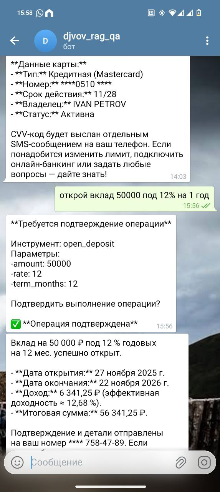

# Отчет о проделанной работе

## Название проекта
**MCP Bank Agent** - Банковский ассистент с поддержкой MCP (Model Context Protocol)

## Описание проекта
Реализован банковский ассистент на базе LangChain с использованием MCP протокола для взаимодействия с банковскими инструментами. Система предоставляет функции поиска продуктов банка, конвертации валют, расчета доходности вкладов, открытия карт и вкладов с поддержкой Human-in-the-Loop и механизмов безопасности.

## Выполненные изменения

### 1. Изменения в embeddings
- **Реализация embeddings изменена на локальный Ollama**
  - Заменена внешняя модель embeddings на локальную версию Ollama
  - Обеспечена автономность и конфиденциальность обработки данных
  - Улучшена производительность за счет локального выполнения

### 2. Добавлены задержки API вызовов
- **Реализованы задержки для предотвращения ошибок**
  - Добавлены задержки между вызовами API к внешним сервисам
  - Предотвращены ошибки rate limiting
  - Улучшена стабильность работы системы

### 3. Новый инструмент open_deposit
- **Добавлен инструмент открытия вкладов в MCP сервер**
  - Принимает параметры: сумма вклада, срок, процентная ставка
  - Возвращает номер договора, телефон клиента (заглушки) и детальные данные вклада
  - Рассчитывает доходность по классической формуле с капитализацией
  - Генерирует случайные данные для номера договора (формат D12345678) и телефона (+7 (XXX) XXX-XX-XX)
  - Включен в Human-in-the-Loop с действиями approve/reject

## Реализованные механизмы безопасности

### 1. Маскирование чувствительных данных
- **PIIMiddleware для защиты персональных данных**
  - Маскирование номеров кредитных карт с помощью встроенного детектора
  - Маскирование номеров телефонов с помощью regex паттерна: `(?:([+]\d{1,4})[-.\s]?)?(?:[(](\d{1,3})[)][-.\s]?)?(\d{1,4})[-.\s]?(\d{1,4})[-.\s]?(\d{1,9})`
  - Защита применяется только к выходным данным (apply_to_output=True)
  - Входные данные не маскируются (apply_to_input=False)

### 2. Лимиты на вызовы
- **ModelCallLimitMiddleware и ToolCallLimitMiddleware**
  - Максимум 2 вызова модели за один запуск
  - Максимум 2 вызова инструментов за один запуск
  - При превышении лимитов выполнение завершается (exit_behavior="end")
  - Предотвращение зацикливания и злоупотреблений

### 3. Human-in-the-Loop
- **Подтверждение пользователем критических операций**
  - Автоматическое прерывание выполнения для операций open_credit_card и open_deposit
  - Требуется подтверждение пользователя через действия "approve" или "reject"
  - Возможность указать причину отклонения при reject
  - Сохранение контекста диалога для продолжения после подтверждения

## Решенные проблемы

### Сложность с Telegram parse_mode
- **Проблема**: Telegram бот возвращал ошибку "невозможно отформатировать ответ"
- **Причина**: Несовместимость с MarkdownV2 parse_mode
- **Решение**: Изменен parse_mode на HTML для корректного форматирования сообщений
- **Результат**: Стабильная работа Telegram интерфейса с корректным отображением форматирования

## Инсайты и выводы

### Ограничения текущей защиты
**Важное наблюдение**: Защита, примененная к агенту, не сработает, если к MCP серверу подключится другой агент и вызовет критичный метод напрямую.

**Пример проблемы**: В текущем проекте, если другой агент подключится к MCP серверу напрямую:
- Будут видны номера карт и телефонов без маскирования
- Не будут действовать лимиты на вызовы модели
- Не будет работать Human-in-the-Loop проверка

**Рекомендации**:
1. Дополнительная защита на уровне MCP сервера
2. Аутентификация и авторизация для MCP подключений
3. Логирование всех операций с чувствительными данными
4. Реализация middleware на уровне MCP сервера

## Дополнительные файлы

### Скриншот результатов

